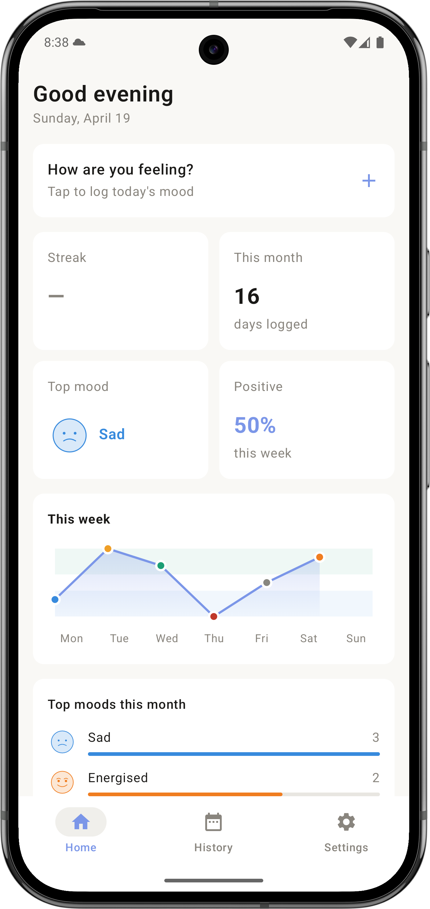
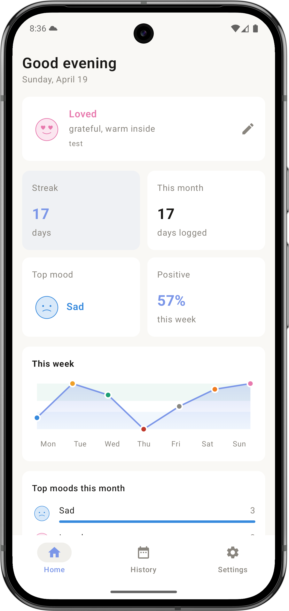
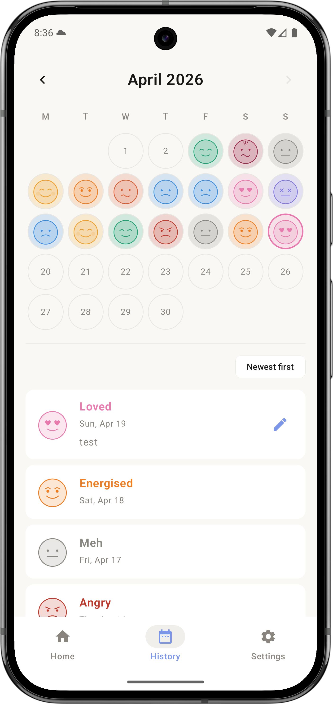
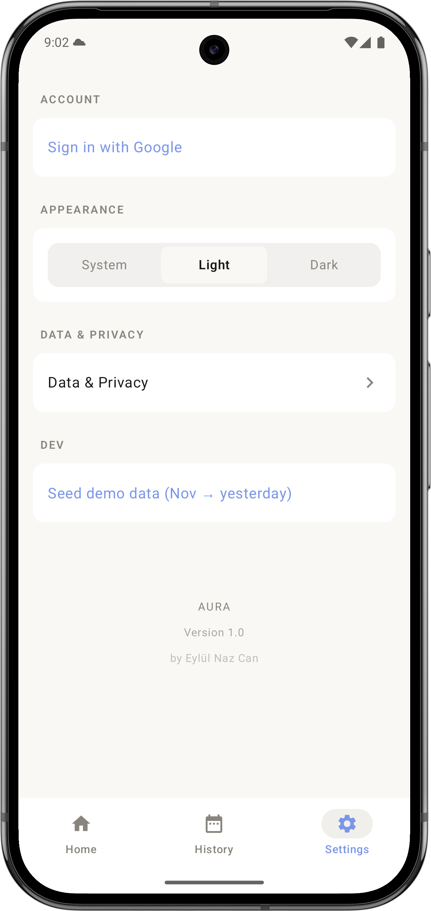
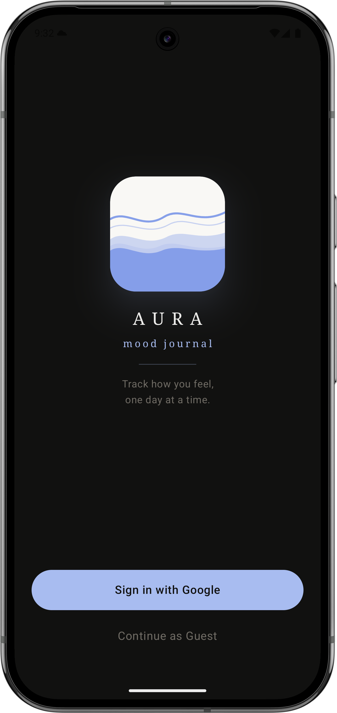
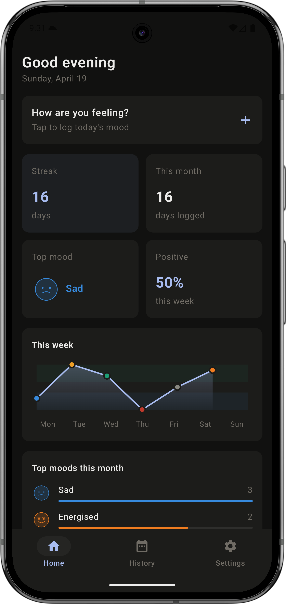
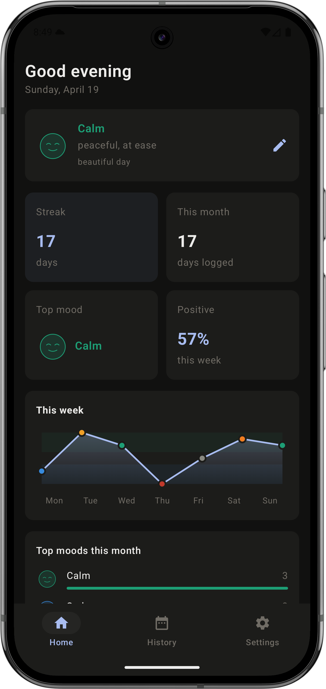
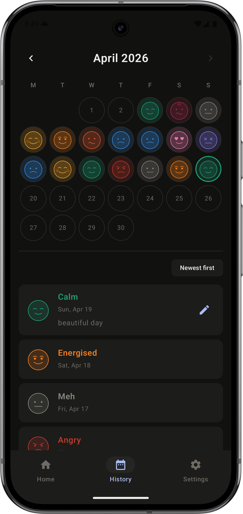
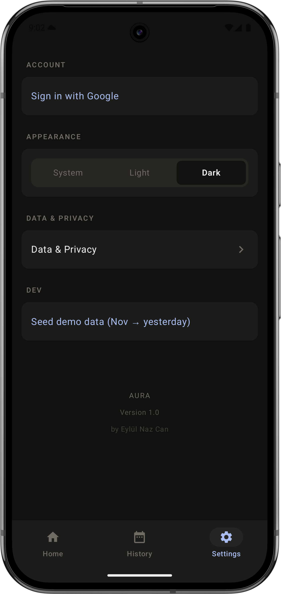

# Aura — Mood Journal

A minimal, thoughtful mood tracking app for Android. Log how you're feeling each day, track patterns
over time, and understand your emotional trends at a glance.

<br>

## Screenshots

### Light Mode

<table>
  <tr>
    <td align="center"><b>Home</b></td>
    <td align="center"><b>Home (logged)</b></td>
    <td align="center"><b>History</b></td>
    <td align="center"><b>Settings</b></td>
  </tr>
  <tr>
    <td></td>
    <td></td>
    <td></td>
    <td></td>
  </tr>
</table>

### Dark Mode

<table>
  <tr>
    <td align="center"><b>Login</b></td>
    <td align="center"><b>Home</b></td>
    <td align="center"><b>Home (logged)</b></td>
    <td align="center"><b>History</b></td>
    <td align="center"><b>Settings</b></td>
  </tr>
  <tr>
    <td></td>
    <td></td>
    <td></td>
    <td></td>
    <td></td>
  </tr>
</table>


<br>

## Mood Icons

13 moods ranging from negative to positive, each with dedicated light and dark variants.

<table>
  <tr>
    <td align="center"><br><sub>Angry</sub></td>
    <td align="center"><br><sub>Overwhelmed</sub></td>
    <td align="center"><br><sub>Anxious</sub></td>
    <td align="center"><br><sub>Sad</sub></td>
    <td align="center"><br><sub>Exhausted</sub></td>
    <td align="center"><br><sub>Tired</sub></td>
    <td align="center"><br><sub>Meh</sub></td>
  </tr>
  <tr>
    <td align="center"><br><sub>Calm</sub></td>
    <td align="center"><br><sub>Good</sub></td>
    <td align="center"><br><sub>Energised</sub></td>
    <td align="center"><br><sub>Happy</sub></td>
    <td align="center"><br><sub>Excited</sub></td>
    <td align="center"><br><sub>Loved</sub></td>
    <td></td>
  </tr>
</table>

<br>

## Features

- **Daily mood logging** — tap the home card to log or edit today's mood via a bottom sheet with a
  13-step slider
- **Mood note** — attach a short note (up to 150 characters) to any entry
- **Home dashboard** — streak, days logged this month, top mood, weekly positive %, 7-day trend
  chart, and top moods breakdown
- **Mood trend chart** — valence-based Y axis with positive/neutral/negative zone bands, gradient
  fill, and mood-colored dots
- **History calendar** — colour-coded monthly calendar with a scrollable entry list; navigate to any
  past month
- **Light & dark mode** — full theme support with dedicated mood icon variants for each theme
- **Google sign-in** — optional account with Firestore sync; guest data is preserved on sign-in
- **Offline-first** — full guest mode with no account required; local data is preserved on sign-in

<br>

## Tech Stack

| Layer      | Library                      |
|------------|------------------------------|
| UI         | Jetpack Compose + Material 3 |
| Navigation | Compose Navigation           |
| State      | ViewModel + StateFlow        |
| Local DB   | Room                         |
| Auth       | Firebase Auth (Google)       |
| Sync       | Cloud Firestore              |
| DI         | Koin                         |
| Min SDK    | 30 (Android 11)              |

<br>

## Roadmap

- [ ] Daily reminder notification — prompt to log mood at a chosen time
- [ ] Home screen widget — see today's mood or quick-log without opening the app
- [ ] iOS app — native SwiftUI, same Firebase project
- [ ] Data export — download entries as CSV
- [ ] Extended trends — monthly and yearly mood views

<br>

## Project Structure

```
ui/
├── home/           # Home dashboard + LogMoodSheet
├── history/        # Calendar + entry list
├── settings/       # Theme picker, account, data & privacy
├── onboarding/     # Google sign-in screen
└── components/     # MoodSvgImage, MoodPicker, FullScreenLoading

viewmodel/          # TodayViewModel, HistoryViewModel, SettingsViewModel
repository/         # MoodRepository, MoodDao, AuraDatabase
constants/          # MoodFace definitions, MOOD_SLIDER_ORDER, MOOD_VALENCE
```

<br>

<sub>by Eylül Naz Can</sub>
